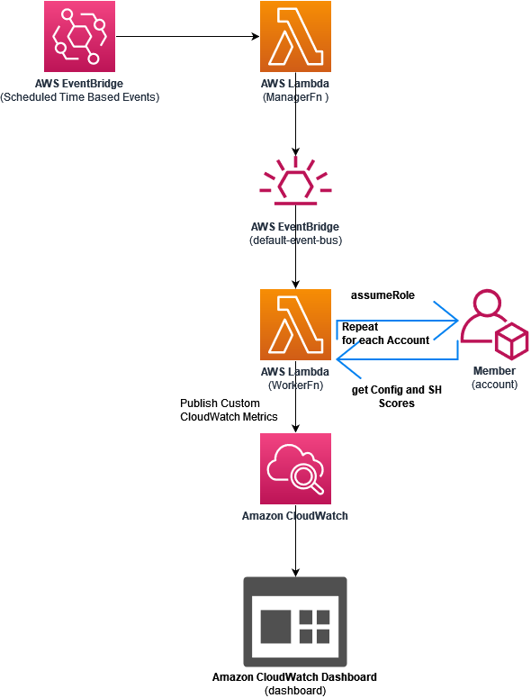
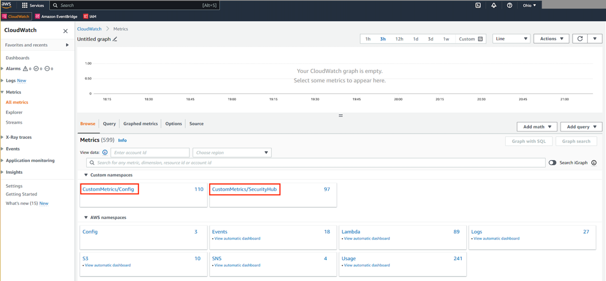
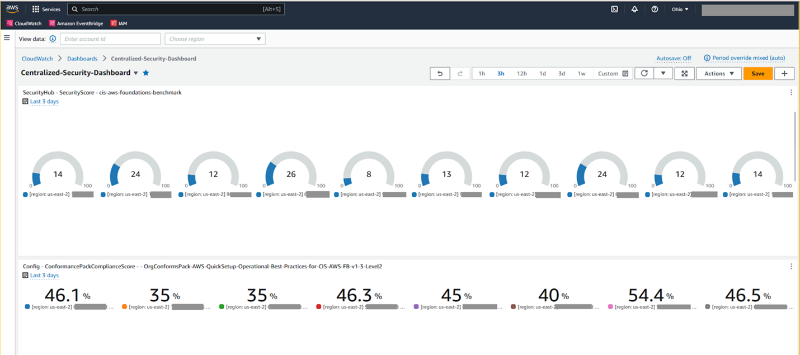

#  Centralized Dashboard for AWS Config and Security Hub

Back in July 2022, we announced [AWS Config Compliance scores for Conformance Packs](https://aws.amazon.com/about-aws/whats-new/2022/07/aws-config-conformance-packs-scores-track-resource-compliance/) which helps you quantify your compliance posture as an [Amazon CloudWatch metric](https://docs.aws.amazon.com/AmazonCloudWatch/latest/monitoring/working_with_metrics.html). It’s a quantitative measure of compliance status. Customer are using the compliance scores to track
the progress of compliance status. While customers can have hundreds of AWS accounts where Config is enabled and each account and each region have a different compliance score. While we can currently track the compliance status with an aggregated score, it is important to look at compliance scores for every account and every region to check the progress made by every team.

In this blog post, we will show you how you can create [Amazon CloudWatch Dashboard](https://docs.aws.amazon.com/AmazonCloudWatch/latest/monitoring/CloudWatch_Dashboards.html) using a custom metric to have a centralized dashboard for monitoring multi account multi region Compliance Scores for AWS Config and also for Security hub

## Architecture



## Prerequisites

To utilize our application, you need the following tools:

- [AWS CLI](https://aws.amazon.com/cli/) – Install the AWS CLI
- [SAM CLI](https://docs.aws.amazon.com/serverless-application-model/latest/developerguide/serverless-sam-cli-install.html) – Install the SAM CLI. The Serverless Application Model Command Line Interface (SAM CLI) is an extension of the AWS CLI that adds functionality for building and testing Lambda applications.
- Python 3.8 – Install Python

## Download the solution

```bash
git clone [git@ssh.gitlab.aws.dev:cca-ambassadors/aws-centralized-dashboard-config-securityhub.git](https://github.com/aws-samples/aws-centralized-dashboard-config-securityhub)
```

## How to build and deploy this application

The application has 2 directories:

- aws_status_check_app – A SAM Application with AWS Lambda functions and AWS CloudFormation Template (template.yaml) to deploy the resources by using SAM CLI. This application is deployed in the AWS Organization management account.
- StacksetCFTemplate – This directory contains an AWS CloudFormation StackSet templatefile that defines the IAM Role and IAM Policy deployed on the member accounts. This IAM Policy and IAM Role is necessary on the member accounts for the application to assumeRole and gather AWS Config service status.

**1.** Build the application with the `sam build` command after navigating into aws_status_check_app

```bash
cd aws_status_check_app
```
```bash
 sam build
```
<details><summary>Click to see sample output</summary>

```bash
sam build
Building codeuri: /local/home/sundjega/centraldashboard/aws-centralized-dashboard-config-securityhub/aws_status_check_app/aws_status_check runtime: python3.8 metadata: {} architecture: x86_64 functions: ManagerFunction, WorkerFunction
Running PythonPipBuilder:ResolveDependencies
Running PythonPipBuilder:CopySource

Build Succeeded

Built Artifacts  : .aws-sam/build
Built Template   : .aws-sam/build/template.yaml

Commands you can use next
=========================
[*] Validate SAM template: sam validate
[*] Invoke Function: sam local invoke
[*] Test Function in the Cloud: sam sync --stack-name {{stack-name}} --watch
[*] Deploy: sam deploy --guided

```
</details>

**2.** This second command will package and deploy your application to AWS, with a series of prompts:

```bash
sam deploy --guided --capabilities CAPABILITY_NAMED_IAM
```

* **Stack Name**: **aws-status-check-app**
* **AWS Region**: - AWS Region where this solution will be deployed.
* **Parameter CheckFrequencyInterval** - This parameter defines how often the lambda function executes to check for the AWS Config Status. Allowed Values are "rate(1 day)", "rate(12 hours)", "rate(6 hours)", "rate(3 hours)", "rate(1 hour)".
* **Parameter CheckAllAccountsinOrgCondition** - If set to true, MemberAccountIds Parameter is ignored, and the application checks the status of AWS Config in all accounts/regions across the AWS Organization. If set to false, proceed to setting the MemberAccountIds parameter. Allowed Values are "true" or "false".
* **Parameter MemberAccountIds** - If parameter CheckAllAccountsinOrgCondition is set to false, enter a comma separated list of AWS account ids where you want the application to check for AWS Config Status. Leave this parameter to it's default value, if you set CheckAllAccountsinOrgCondition to true. [Eg: 12345634344,434345555333,455454545324]
* **Confirm changes before deploy**: If set to yes, any change sets will be shown to you before execution for manual review. If set to no, the AWS SAM CLI will automatically deploy application changes.
* **Allow SAM CLI IAM role creation**: To deploy this application's AWS CloudFormation stack which creates or modifies IAM roles, the `CAPABILITY_IAM` value for `capabilities` must be provided. If permission isn't provided through this prompt, to deploy this example you must explicitly pass `--capabilities CAPABILITY_IAM` to the `sam deploy` command.
* **Save arguments to samconfig.toml**: If set to yes, your choices will be saved to a configuration file inside the project, so that in the future you can just re-run `sam deploy` without parameters to deploy changes to your application.

<details><summary>Click to see sample output</summary>

```bash

sam deploy --guided --capabilities CAPABILITY_NAMED_IAM

Configuring SAM deploy
======================

        Looking for config file [samconfig.toml] :  Not found

        Setting default arguments for 'sam deploy'
        =========================================
        Stack Name [sam-app]: aws-status-check-app
        AWS Region [us-east-1]: us-east-2
        Parameter CheckFrequencyMins [rate(1 day)]: rate(1 day)
        Parameter CheckAllAccountsinOrgCondition [true]:
        Parameter MemberAccountIds [IGNORE,IF,CheckAllAccountsinOrg,TRUE]:
        #Shows you resources changes to be deployed and require a 'Y' to initiate deploy
        Confirm changes before deploy [y/N]: y
        #SAM needs permission to be able to create roles to connect to the resources in your template
        Allow SAM CLI IAM role creation [Y/n]: Y
        #Preserves the state of previously provisioned resources when an operation fails
        Disable rollback [y/N]: y
        Save arguments to configuration file [Y/n]: Y
        SAM configuration file [samconfig.toml]:
        SAM configuration environment [default]:

        Looking for resources needed for deployment:

        Managed S3 bucket: aws-sam-cli-managed-default-samclisourcebucket-1bctiwbckuz4w
        A different default S3 bucket can be set in samconfig.toml and auto resolution of buckets turned off by setting resolve_s3=False

        Saved arguments to config file
        Running 'sam deploy' for future deployments will use the parameters saved above.
        The above parameters can be changed by modifying samconfig.toml
        Learn more about samconfig.toml syntax at
        https://docs.aws.amazon.com/serverless-application-model/latest/developerguide/serverless-sam-cli-config.html

        Uploading to aws-status-check-app/260bddab803770c56a539cca40ce28d9  4509 / 4509  (100.00%)
File with same data already exists at aws-status-check-app/260bddab803770c56a539cca40ce28d9, skipping upload

        Deploying with following values
        ===============================
        Stack name                   : aws-status-check-app
        Region                       : us-east-2
        Confirm changeset            : True
        Disable rollback             : True
        Deployment s3 bucket         : aws-sam-cli-managed-default-samclisourcebucket-1bctiwbckuz4w
        Capabilities                 : ["CAPABILITY_NAMED_IAM"]
        Parameter overrides          : {"CheckFrequencyMins": "rate(1 day)", "CheckAllAccountsinOrgCondition": "true", "MemberAccountIds": "IGNORE,IF,CheckAllAccountsinOrg,TRUE"}
        Signing Profiles             : {}

Initiating deployment
=====================

        Uploading to aws-status-check-app/752cc090fa93293635f6b8f07888fe5a.template  7794 / 7794  (100.00%)


Waiting for changeset to be created..

CloudFormation stack changeset
---------------------------------------------------------------------------------------------------------------------------------------------------------------------------------------------------------------------------------------------------------------------------------------------------------------------------------------------
Operation                                                                           LogicalResourceId                                                                   ResourceType                                                                        Replacement
---------------------------------------------------------------------------------------------------------------------------------------------------------------------------------------------------------------------------------------------------------------------------------------------------------------------------------------------
+ Add                                                                               AppFunctionPolicy                                                                   AWS::IAM::ManagedPolicy                                                             N/A
+ Add                                                                               AppFunctionRole                                                                     AWS::IAM::Role                                                                      N/A
+ Add                                                                               AssumedFunctionRole                                                                 AWS::IAM::Role                                                                      N/A
+ Add                                                                               CheckAllAccountsinOrgParameter                                                      AWS::SSM::Parameter                                                                 N/A
+ Add                                                                               ConfigAccountsParameter                                                             AWS::SSM::Parameter                                                                 N/A
+ Add                                                                               ManagerFunctionLogGroup                                                             AWS::Logs::LogGroup                                                                 N/A
+ Add                                                                               ManagerFunctionScheduledRule                                                        AWS::Events::Rule                                                                   N/A
+ Add                                                                               ManagerFunction                                                                     AWS::Lambda::Function                                                               N/A
+ Add                                                                               PermissionForEventsToInvokeLambda1                                                  AWS::Lambda::Permission                                                             N/A
+ Add                                                                               PermissionForEventsToInvokeLambda2                                                  AWS::Lambda::Permission                                                             N/A
+ Add                                                                               WorkerFunctionLogGroup                                                              AWS::Logs::LogGroup                                                                 N/A
+ Add                                                                               WorkerFunctionRule                                                                  AWS::Events::Rule                                                                   N/A
+ Add                                                                               WorkerFunction                                                                      AWS::Lambda::Function                                                               N/A
---------------------------------------------------------------------------------------------------------------------------------------------------------------------------------------------------------------------------------------------------------------------------------------------------------------------------------------------


Changeset created successfully. arn:aws:cloudformation:us-east-2:980861844405:changeSet/samcli-deploy1690484417/bbcba1ce-e8ca-4ecc-b1a6-b12beca2aaa2


Previewing CloudFormation changeset before deployment
======================================================
Deploy this changeset? [y/N]: y

2023-07-27 19:00:26 - Waiting for stack create/update to complete

CloudFormation events from stack operations (refresh every 5.0 seconds)
---------------------------------------------------------------------------------------------------------------------------------------------------------------------------------------------------------------------------------------------------------------------------------------------------------------------------------------------
ResourceStatus                                                                      ResourceType                                                                        LogicalResourceId                                                                   ResourceStatusReason
---------------------------------------------------------------------------------------------------------------------------------------------------------------------------------------------------------------------------------------------------------------------------------------------------------------------------------------------
CREATE_IN_PROGRESS                                                                  AWS::IAM::ManagedPolicy                                                             AppFunctionPolicy                                                                   -
CREATE_IN_PROGRESS                                                                  AWS::SSM::Parameter                                                                 ConfigAccountsParameter                                                             -
CREATE_IN_PROGRESS                                                                  AWS::Logs::LogGroup                                                                 WorkerFunctionLogGroup                                                              -
CREATE_IN_PROGRESS                                                                  AWS::SSM::Parameter                                                                 CheckAllAccountsinOrgParameter                                                      -
CREATE_IN_PROGRESS                                                                  AWS::Logs::LogGroup                                                                 ManagerFunctionLogGroup                                                             -
CREATE_IN_PROGRESS                                                                  AWS::IAM::ManagedPolicy                                                             AppFunctionPolicy                                                                   Resource creation Initiated
CREATE_IN_PROGRESS                                                                  AWS::SSM::Parameter                                                                 ConfigAccountsParameter                                                             Resource creation Initiated
CREATE_IN_PROGRESS                                                                  AWS::Logs::LogGroup                                                                 WorkerFunctionLogGroup                                                              Resource creation Initiated
CREATE_IN_PROGRESS                                                                  AWS::SSM::Parameter                                                                 CheckAllAccountsinOrgParameter                                                      Resource creation Initiated
CREATE_IN_PROGRESS                                                                  AWS::Logs::LogGroup                                                                 ManagerFunctionLogGroup                                                             Resource creation Initiated
CREATE_COMPLETE                                                                     AWS::Logs::LogGroup                                                                 WorkerFunctionLogGroup                                                              -
CREATE_COMPLETE                                                                     AWS::SSM::Parameter                                                                 ConfigAccountsParameter                                                             -
CREATE_COMPLETE                                                                     AWS::Logs::LogGroup                                                                 ManagerFunctionLogGroup                                                             -
CREATE_COMPLETE                                                                     AWS::SSM::Parameter                                                                 CheckAllAccountsinOrgParameter                                                      -
CREATE_COMPLETE                                                                     AWS::IAM::ManagedPolicy                                                             AppFunctionPolicy                                                                   -
CREATE_IN_PROGRESS                                                                  AWS::IAM::Role                                                                      AppFunctionRole                                                                     -
CREATE_IN_PROGRESS                                                                  AWS::IAM::Role                                                                      AssumedFunctionRole                                                                 -
CREATE_IN_PROGRESS                                                                  AWS::IAM::Role                                                                      AppFunctionRole                                                                     Resource creation Initiated
CREATE_IN_PROGRESS                                                                  AWS::IAM::Role                                                                      AssumedFunctionRole                                                                 Resource creation Initiated
CREATE_COMPLETE                                                                     AWS::IAM::Role                                                                      AssumedFunctionRole                                                                 -
CREATE_COMPLETE                                                                     AWS::IAM::Role                                                                      AppFunctionRole                                                                     -
CREATE_IN_PROGRESS                                                                  AWS::Lambda::Function                                                               WorkerFunction                                                                      -
CREATE_IN_PROGRESS                                                                  AWS::Lambda::Function                                                               ManagerFunction                                                                     -
CREATE_IN_PROGRESS                                                                  AWS::Lambda::Function                                                               WorkerFunction                                                                      Resource creation Initiated
CREATE_IN_PROGRESS                                                                  AWS::Lambda::Function                                                               ManagerFunction                                                                     Resource creation Initiated
CREATE_COMPLETE                                                                     AWS::Lambda::Function                                                               WorkerFunction                                                                      -
CREATE_COMPLETE                                                                     AWS::Lambda::Function                                                               ManagerFunction                                                                     -
CREATE_IN_PROGRESS                                                                  AWS::Events::Rule                                                                   WorkerFunctionRule                                                                  -
CREATE_IN_PROGRESS                                                                  AWS::Events::Rule                                                                   ManagerFunctionScheduledRule                                                        -
CREATE_IN_PROGRESS                                                                  AWS::Events::Rule                                                                   ManagerFunctionScheduledRule                                                        Resource creation Initiated
CREATE_IN_PROGRESS                                                                  AWS::Events::Rule                                                                   WorkerFunctionRule                                                                  Resource creation Initiated
CREATE_COMPLETE                                                                     AWS::Events::Rule                                                                   ManagerFunctionScheduledRule                                                        -
CREATE_COMPLETE                                                                     AWS::Events::Rule                                                                   WorkerFunctionRule                                                                  -
CREATE_IN_PROGRESS                                                                  AWS::Lambda::Permission                                                             PermissionForEventsToInvokeLambda1                                                  -
CREATE_IN_PROGRESS                                                                  AWS::Lambda::Permission                                                             PermissionForEventsToInvokeLambda2                                                  -
CREATE_IN_PROGRESS                                                                  AWS::Lambda::Permission                                                             PermissionForEventsToInvokeLambda1                                                  Resource creation Initiated
CREATE_IN_PROGRESS                                                                  AWS::Lambda::Permission                                                             PermissionForEventsToInvokeLambda2                                                  Resource creation Initiated
CREATE_COMPLETE                                                                     AWS::Lambda::Permission                                                             PermissionForEventsToInvokeLambda1                                                  -
CREATE_COMPLETE                                                                     AWS::Lambda::Permission                                                             PermissionForEventsToInvokeLambda2                                                  -
CREATE_COMPLETE                                                                     AWS::CloudFormation::Stack                                                          aws-status-check-app                                                                -
---------------------------------------------------------------------------------------------------------------------------------------------------------------------------------------------------------------------------------------------------------------------------------------------------------------------------------------------

CloudFormation outputs from deployed stack
---------------------------------------------------------------------------------------------------------------------------------------------------------------------------------------------------------------------------------------------------------------------------------------------------------------------------------------------
Outputs
---------------------------------------------------------------------------------------------------------------------------------------------------------------------------------------------------------------------------------------------------------------------------------------------------------------------------------------------
Key                 ManagerFunctionARN
Description         ManagerFunction ARN
Value               arn:aws:lambda:us-east-2:980861844405:function:aws-status-check-app-ManagerFunction-oXx2fvZGftLJ

Key                 WorkerFunctionARN
Description         WorkerFunction ARN
Value               arn:aws:lambda:us-east-2:980861844405:function:aws-status-check-app-WorkerFunction-HBY2theGkFFj
---------------------------------------------------------------------------------------------------------------------------------------------------------------------------------------------------------------------------------------------------------------------------------------------------------------------------------------------


Successfully created/updated stack - aws-status-check-app in us-east-2

```
</details>

**3.** Create a AWS CloudFormation StackSet using AWS CLI. Make sure you have the [required permissions for stack sets operations](https://docs.aws.amazon.com/AWSCloudFormation/latest/UserGuide/stacksets-prereqs.html). Provide the AWS Management account Id where this StackSet will be deployed.

```bash
cd ../StacksetCFTemplate
aws cloudformation create-stack-set \
    --description "role/policies for aws config checker" \
    --stack-set-name aws-status-checker-stackset \
    --template-body file://stacksettemplate.yml \
    --permission-model SERVICE_MANAGED \
    --capabilities CAPABILITY_NAMED_IAM \
    --parameters ParameterKey=AdministratorAccountId,ParameterValue=<AWS_ManagementAccountId> \
    --auto-deployment Enabled=true,RetainStacksOnAccountRemoval=false
```
<details><summary>Click to see sample output</summary>

```
StacksetCFTemplate$ aws cloudformation create-stack-set \
>     --description "role/policies for aws config checker" \
>     --stack-set-name aws-status-checker-stackset \
>     --template-body file://stacksettemplate.yml \
>     --permission-model SERVICE_MANAGED \
>     --capabilities CAPABILITY_NAMED_IAM \
>     --parameters ParameterKey=AdministratorAccountId,ParameterValue=xxxxxxxxxx \
>     --auto-deployment Enabled=true,RetainStacksOnAccountRemoval=false
{
    "StackSetId": "aws-config-checker-stackset:273c07d1-c7ab-4e6c-b388-0f6e2263c400"
}

```
</details>

**4.** Create an AWS CloudFormation Stack Instances by using AWS CLI. Provide the OrganizationalUnitIds of the member accounts to which the Stack Instances are deployed.

```bash
aws cloudformation create-stack-instances \
    --deployment-targets OrganizationalUnitIds=<Organizational_Unit_Ids> \
    --stack-set-name aws-status-checker-stackset  --regions us-east-2
```
<details><summary>Click to see sample output</summary>

```
StacksetCFTemplate$ aws cloudformation create-stack-instances \
>     --deployment-targets OrganizationalUnitIds=r-xxxx \
>     --stack-set-name aws-status-checker-stackset  --regions us-east-2
{
    "OperationId": "1e740a93-e980-44e0-a4d6-6747384dab2f"
}

```
</details>

## Troubleshooting the Lambda function

In order to simplify troubleshooting, SAM CLI has a command called sam logs. sam logs lets you fetch logs generated by your deployed Lambda function from the command line. In addition to printing the logs on the terminal, this command has several useful features to help you quickly find the bug.

```bash
sam logs -n WorkerFunction --stack-name aws-status-check-app --tail
```

```bash
sam logs -n ManagerFunction --stack-name aws-status-check-app --tail
```

## Create CloudWatch Dashboard using custom metrics

After a few minutes login to [Amazon CloudWatch Console](https://console.aws.amazon.com/cloudwatch) to view custom metrics under Custom namespace named CustomMetrics/Config and CustomMetrics/SecurityHub.



Follow the steps [here to create CloudWatch dashboard](https://docs.aws.amazon.com/AmazonCloudWatch/latest/monitoring/create_dashboard.html) from custom metrics. Below is the sample centralized dashboard for Compliance Scores and Security Hub Score



## Cleanup

**1.** To delete the awsconfigstatuscheck application that you created, use the SAM CLI.

```bash
sam delete
```
<details><summary>Click to see sample output</summary>

```
aws_status_check_app$ sam delete
        Are you sure you want to delete the stack awsconfigstatuschecker-app in the region us-east-2 ? [y/N]: y
        Are you sure you want to delete the folder awsconfigstatuschecker-app in S3 which contains the artifacts? [y/N]: y
        - Deleting S3 object with key awsconfigstatuschecker-app/aca923a2899ecef9bb25fc9d708b2067
        - Could not find and delete the S3 object with the key awsconfigstatuschecker-app/aca923a2899ecef9bb25fc9d708b2067
        - Deleting S3 object with key awsconfigstatuschecker-app/23b0a7ffd14c825f099b0d67a2d1ae18.template
        - Deleting S3 object with key awsconfigstatuschecker-app/26d62b2b9477b02ff57126cd6a59be0b.template
        - Deleting S3 object with key awsconfigstatuschecker-app/938f74b20506773321240e7555ac4910.template
        - Deleting S3 object with key awsconfigstatuschecker-app/93c76ece26e084135707d1b4b26f053b.template
        - Deleting S3 object with key awsconfigstatuschecker-app/b93be3ce737bcac83d43d92246689245.template
        - Deleting S3 object with key awsconfigstatuschecker-app/f81beb0c1361619d6542ef6017556482.template
        - Deleting Cloudformation stack awsconfigstatuschecker-app

Deleted successfully

```
</details>

**2.** Delete the Stack Instances from AWS CloudFormation StackSet using AWS CLI.

```bash
aws cloudformation delete-stack-instances --stack-set-name aws-status-checker-stackset  --regions us-east-1 --no-retain-stacks --deployment-targets OrganizationalUnitIds=<Organizational_Unit_Ids>
```

**3.** Wait for Step 2 to finish. Then, delete the AWS CloudFormation StackSet using AWS CLI.

```bash
aws cloudformation delete-stack-set --stack-set-name aws-status-checker-stackset
```

## Conclusion

In this blog post, we showed you how to create custom metric to create a centralized dashboard for monitoring multi account , multi region compliance scores for AWS Config and also for AWS Security hub. We further used this custom metrics to create centralized security dashboard using Amazon CloudWatch Dashboard for AWS Config compliance score and Security Hub.
